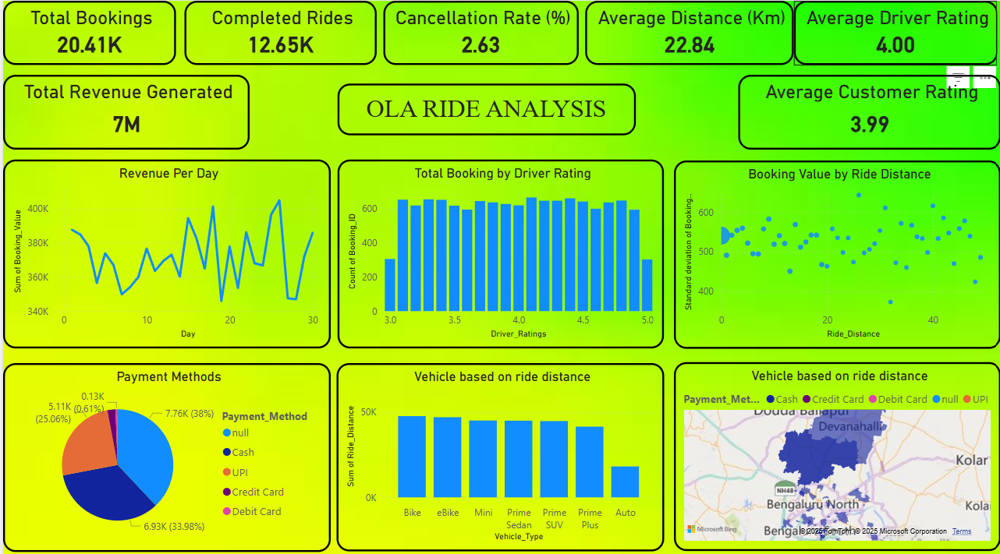

# 🚖 Ola Ride Analytics Dashboard  

*A Power BI Dashboard for Analyzing Ola Ride Data*  

  

## 📌 Overview  
The **Ola Ride Analytics Dashboard** provides insights into key ride-hailing metrics such as total bookings, revenue, ride distances, cancellation rates, payment methods, and driver/customer ratings.  

This dashboard helps in understanding user behavior, optimizing ride operations, and improving customer satisfaction.  

---

## 📊 Key Features  
✅ **Total Bookings & Completed Rides** – Track ride volume and completion rates.  
✅ **Revenue Insights** – Monitor daily revenue trends and total earnings.  
✅ **Cancellation Rate (%)** – Identify and analyze ride cancellations.  
✅ **Driver & Customer Ratings** – Evaluate service quality and user satisfaction.  
✅ **Ride Distance Analysis** – Understand ride trends and revenue impact.  
✅ **Payment Methods Distribution** – Analyze customer payment preferences.  
✅ **Vehicle Usage by Ride Distance** – Identify the most used vehicle types.  
✅ **Geographical Insights** – Visualize ride demand across locations.  

---

## 🛠️ Tools Used  
- **Power BI** – Dashboard creation and data visualization  
- **Excel/CSV** – Data preprocessing  
- **DAX (Data Analysis Expressions)** – Custom calculations and measures  
- **Power Query** – Data transformation  

---

## 📂 Dataset Information  
The dataset includes:  
- **Booking ID, Ride Status, Revenue**  
- **Distance (km), Ride Duration**  
- **Payment Method (Cash, UPI, Debit, Credit Card)**  
- **Customer & Driver Ratings**  
- **Vehicle Type**  

📌 **Note:** The dataset is not included in this repository due to confidentiality.  

---

## 📥 How to Use This Dashboard  
1. **Download the Power BI File (.pbix)** *(Upload your .pbix file if needed)*  
2. Open it in **Microsoft Power BI Desktop**  
3. Connect to the data source (if required)  
4. Explore the interactive visuals and gain insights  

---

## 📌 Key Insights  
🔹 **Total Revenue:** 7M | **Total Bookings:** 20.41K  
🔹 **Average Ride Distance:** 22.84 km  
🔹 **Low Cancellation Rate:** 2.63%  
🔹 **Cash & UPI are the most preferred payment methods**  
🔹 **Driver Ratings impact bookings – Higher-rated drivers get more rides**  
🔹 **E-bikes and Mini vehicles are popular for shorter rides**  

---

## 🔮 Future Enhancements  
🚀 **Real-time Data Integration** – Fetching live ride data using APIs.  
🚀 **Predictive Analytics** – Forecasting revenue and demand trends.  
🚀 **Advanced Geospatial Analysis** – City-wise demand heatmaps.  

---

### 🔗 Connect & Follow  
🔗 **LinkedIn** – [YourLinkedIn](https://www.linkedin.com/in/atharva-khadse)  

📊 **Happy Analyzing!** 🚀  
